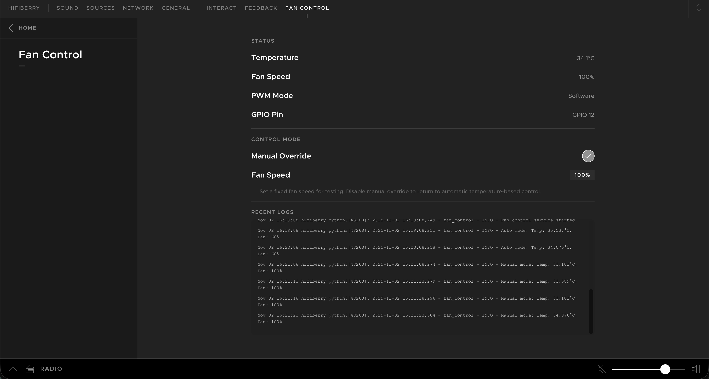

# Fan Control for HiFiBerry OS

This is a fan control service for [HiFiBerry OS](https://github.com/hifiberry/hifiberry-os) that monitors CPU temperature and adjusts fan speed accordingly. It integrates seamlessly with HiFiBerry OS by adding a web interface extension to the Beocreate UI.



## Features

- **Automatic Temperature-Based Fan Control**: Adjusts fan speed based on CPU temperature thresholds
- **Web Interface**: Real-time monitoring of temperature, fan speed, and logs through the HiFiBerry OS web interface
- **No Dependencies**: Uses sysfs GPIO interface (no RPi.GPIO library required)
- **HiFiBerry OS Compatible**: Designed specifically for the minimal Buildroot-based HiFiBerry OS

## Requirements

- HiFiBerry OS running on Raspberry Pi
- Python 3 installed
- Root access to the system
- Fan connected to GPIO pin 12 (configurable)

## Installation

### Quick Install

Clone this repository and run the installation script:

```bash
git clone https://github.com/Leoname/hifiberry_fan_control.git
cd hifiberry_fan_control
sudo ./install.sh
```

The installation script will:
- Copy all necessary files to `/opt/hifiberry/fan-control/`
- Install and enable the fan control service
- Install and enable the API server
- Add the Fan Control extension to Beocreate UI
- Restart Beocreate2 to load the extension

## Usage

### Web Interface

After installation, access the Fan Control interface through the HiFiBerry OS web interface. The extension will appear in the sources menu, showing:

- **Current CPU Temperature**: Real-time temperature reading with color indicators
- **Fan Speed**: Current fan duty cycle percentage with visual progress bar
- **PWM Mode**: Whether using hardware or software PWM
- **Recent Logs**: Live log output from the fan control service

### Manual Service Control

#### Using systemd (if available):

```bash
# Start services
systemctl start fan-control.service
systemctl start fan-api.service

# Stop services
systemctl stop fan-control.service
systemctl stop fan-api.service

# Check status
systemctl status fan-control.service
systemctl status fan-api.service

# View logs
journalctl -u fan-control.service -f
journalctl -u fan-api.service -f
```

#### Using init scripts (BusyBox):

```bash
# Start services
/etc/init.d/fan-control start
/etc/init.d/fan-api start

# Stop services
/etc/init.d/fan-control stop
/etc/init.d/fan-api stop

# Check status
/etc/init.d/fan-control status
/etc/init.d/fan-api status

# View logs
tail -f /var/log/fan-control.log
tail -f /var/log/fan-api.log
```

## Configuration

### Temperature Thresholds

The fan control uses the following temperature thresholds (configurable in `fan_control.py`):

- **≥ 50°C**: Fan at 100% duty cycle, check every 180 seconds
- **≥ 40°C**: Fan at 85% duty cycle, check every 120 seconds
- **< 40°C**: Fan at 60% duty cycle, check every 60 seconds

To modify these thresholds, edit `/opt/hifiberry/fan-control/fan_control.py` and restart the service.

### GPIO Pin

The default GPIO pin is 12 (BCM numbering). To use a different pin:

1. Edit `/opt/hifiberry/fan-control/fan_control.py`
2. Change the `GPIO_PIN` variable (line 19)
3. Restart the service

## API Endpoints

The API server runs on port 8088 and provides:

- `GET /api/status` - Returns current status (temperature, duty cycle, PWM mode, etc.)
- `GET /api/logs` - Returns recent log entries

Example:

```bash
curl http://localhost:8088/api/status
```

## How It Works

1. **Temperature Reading**: Reads CPU temperature from `/sys/class/thermal/thermal_zone0/temp` (compatible with HiFiBerry OS - no `vcgencmd` required)

2. **Fan Control**: Uses sysfs GPIO interface for PWM control:
   - Attempts to use hardware PWM first (via `/sys/class/pwm/pwmchip0`)
   - Falls back to software PWM if hardware PWM is not available

3. **Status Updates**: Writes current status to `/opt/hifiberry/fan-control/status.json` for the web interface

4. **Web Interface**: Beocreate extension polls the API server every 2 seconds to display real-time information

## Troubleshooting

### Service won't start

1. Check service status: `systemctl status fan-control.service` or `/etc/init.d/fan-control status`
2. Check logs: `journalctl -u fan-control.service` or `tail -f /var/log/fan-control.log`
3. Verify Python script is executable: `ls -l /opt/hifiberry/fan-control/fan_control.py`
4. Test script manually: `/usr/bin/python3 /opt/hifiberry/fan-control/fan_control.py`

### Temperature reading fails

Test temperature reading manually:
```bash
cat /sys/class/thermal/thermal_zone0/temp
```

This should return a number (temperature in millidegrees Celsius). If it fails:
- Check if thermal zone exists: `ls -la /sys/class/thermal/`
- Check system logs: `dmesg | grep thermal`

### GPIO permission issues

The service runs as root by default, which should have GPIO access. If you encounter issues:

1. Verify you're running as root: `whoami` should return `root`
2. Test GPIO export manually:
   ```bash
   echo 12 > /sys/class/gpio/export
   echo out > /sys/class/gpio/gpio12/direction
   echo 1 > /sys/class/gpio/gpio12/value
   cat /sys/class/gpio/gpio12/value
   echo 0 > /sys/class/gpio/gpio12/value
   echo 12 > /sys/class/gpio/unexport
   ```

### Web interface not showing

1. Verify the extension is installed: `ls -la /opt/beocreate/beo-extensions/fan-control/`
2. Restart Beocreate2: `systemctl restart beocreate2` or `/etc/init.d/beocreate2 restart`
3. Check API server is running: `curl http://localhost:8088/api/status`
4. Check browser console for errors

### API server not responding

1. Check if API server is running: `systemctl status fan-api.service` or `/etc/init.d/fan-api status`
2. Test API endpoint: `curl http://localhost:8088/api/status`
3. Check for port conflicts: `netstat -tuln | grep 8088`
4. View API logs: `journalctl -u fan-api.service -f` or `tail -f /var/log/fan-api.log`

## Uninstallation

Use the automated uninstall script to completely remove Fan Control:

```bash
# On the HiFiBerry OS device
./uninstall.sh

# Or with auto-confirm (no prompt)
./uninstall.sh -y
```

The uninstall script will:
- Stop and disable all services
- Remove all installed files and directories
- Clean up GPIO exports
- Remove the Beocreate extension
- Restart Beocreate to unload the extension

Manual uninstallation steps are available in [INSTALL.md](INSTALL.md).

## Technical Details

### Compatibility

- **HiFiBerry OS**: Built on Buildroot, minimal system
- **Python 3**: Standard library only (no external dependencies)
- **GPIO Control**: Uses sysfs interface (`/sys/class/gpio/`)
- **Temperature Reading**: Uses `/sys/class/thermal/thermal_zone0/temp`
- **PWM**: Hardware PWM via `/sys/class/pwm/` or software PWM fallback

### File Structure

```
/opt/hifiberry/fan-control/
├── fan_control.py          # Main fan control service
├── fan_api_server.py       # API server for web interface
└── status.json             # Current status (updated by service)

/opt/beocreate/beo-extensions/fan-control/
├── index.js                # Beocreate extension logic
├── ui.html                 # HTML interface
├── ui.js                   # UI JavaScript
└── ui.css                  # Styles
```

## Contributing

Contributions are welcome! Please feel free to submit issues or pull requests.

## License

MIT License - see [LICENSE](LICENSE) file for details.

## Acknowledgments

- Built for [HiFiBerry OS](https://github.com/hifiberry/hifiberry-os) - a minimal Linux distribution optimized for audio playback
- Modeled after the installation approach from [tidal-connect-docker](https://github.com/TonyTromp/tidal-connect-docker)
- Designed for HiFiBerry OS compatibility and Beocreate UI integration

